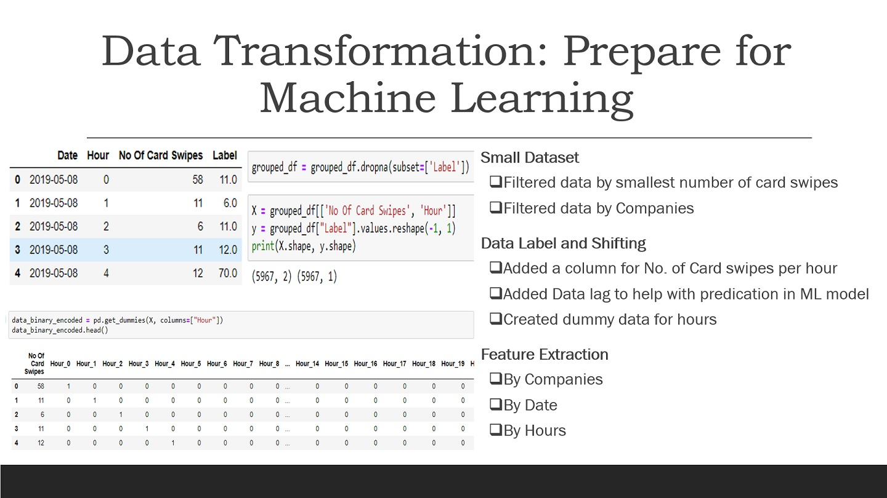

# Building_Utilization

• We were tasked to analyze multi-tenant office space building card swipe data (million rows of key card data) to predict occupancy rates by hour of the day, this information can be used to create “Intelligent” buildings by efficiently using many resources like HVAC system & lighting of the building.

• Initially dummy data set was provided, an excel sheet that lists each of the tenant user's entry and exit in the building. 3 disparate tables, approximately 1000 rows, consisting of building occupant information consisting of Company Name, KeyCard ID, Time of Entry, Time of Exit, Point of Entry, etc. 

• We used sample data to develop and train the machine learning model to find occupancy rate by hour.

• We used Matplotlib to create box plots for each hour of the day to better understand the data and distribution of data. 

• Used Tableau to visualize the card swipes trend by tenant.

(Images/hourlydata.png)

• We did data transformation to prepare for machine learning. 

• Used various machine learning models like linear regression, KNN, and Random Forest Regression to find the best possible fit. We got the best R2 value of 0.98 using Random Forest Regression and were able to predict the number of card swipes for the next hour.
